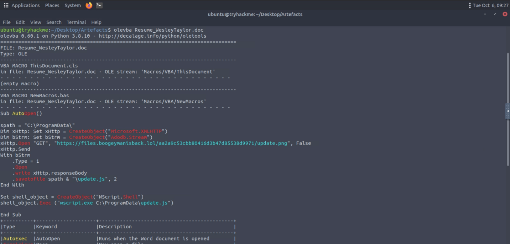
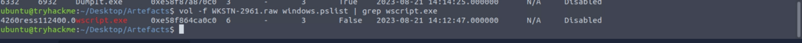
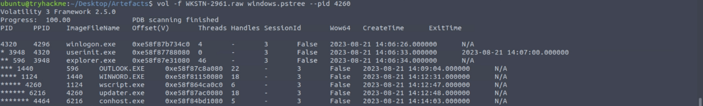
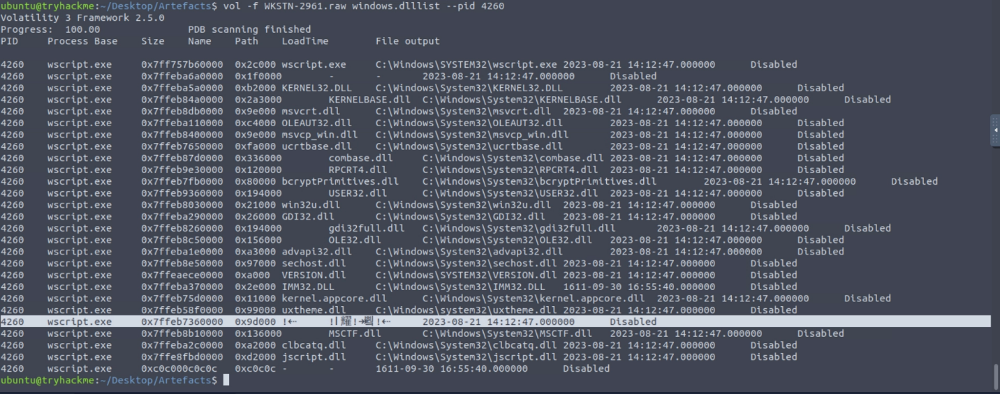
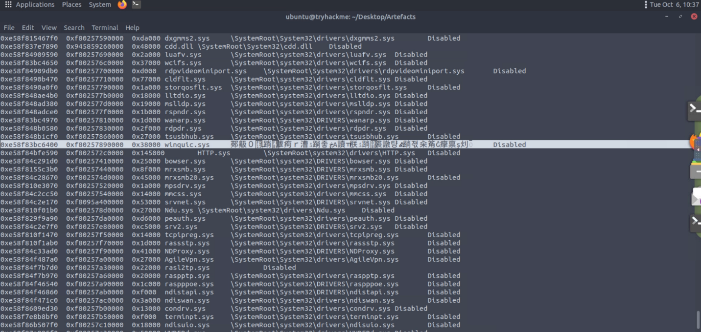
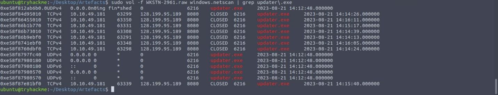
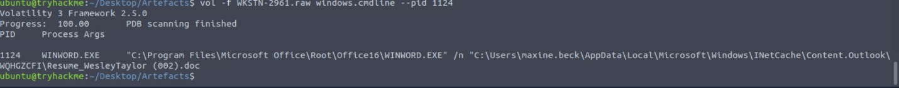
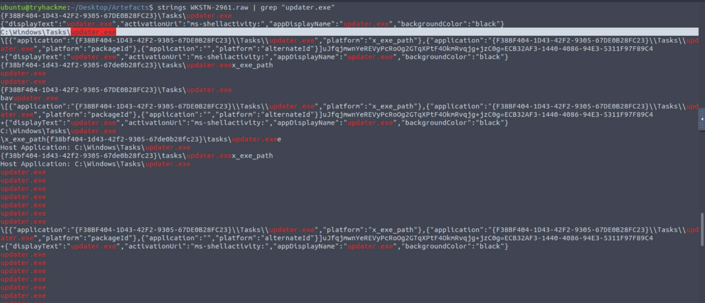
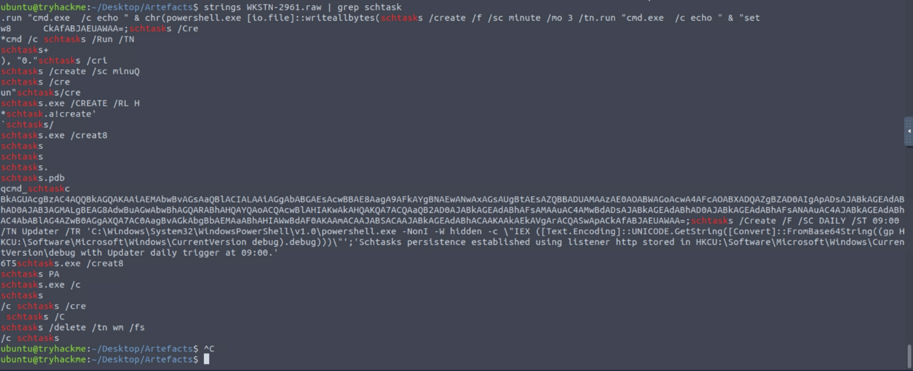

# Boogeyman 2

**Boogeyman 2 Incident Report**

**Indices:**

1. **Briefing**
2. **Artifacts**
3. **Investigation**
4. **IOCs**
5. **Timeline**
6. **MITRE ATT&CK Mapping**

**1.Briefing :**

Maxine, a Human Resource Specialist working for Quick Logistics LLC, received an application from one of the open positions in the company. Unbeknownst to her, the attached resume was malicious and compromised her workstation.

**2.Artifacts :**

- Copy of the phishing email.
- Memory dump of the victim's workstation.

**3.Investigation :**

We start by accessing the mail

received From:[westaylor23@outlook.com](mailto:westaylor23@outlook.com)

To : [maxine.beck@quicklogisticsorg.onmicrosoft.com](mailto:maxine.beck@quicklogisticsorg.onmicrosoft.com)

Name of the file : Resume_WesleyTaylor.doc

MD5 : 52c4384a0b9e248b95804352ebec6c5b

SHA256: 4db25ee3c46be38aa219fe2192711af65d55d5d7e25a889bb9990beb19f9b8b0

using olevba to extract the macros in the file we find

we find it connecting and downloading a file :

hxxps[://]files[.]boogeymanisback[.]lol/aa2a9c53cbb80416d3b47d85538d9971/update[.]png

it saved as C:\ProgramData\update.js

it uses wscript.exe to execute the file

now to analyze the memory dump

vol -f WKSTN-2961.raw windows.pslist | grep wscript.exe

by using this command we can find the pid ppid and process name

pid 4260

ppid 1124

pname wscript.exe

vol -f WKSTN-2961.raw windows.pstree --pid 4260

using this command we find all processes related to the malware

updater.exe pid: 6216 ppid 4260

conhost.exe pid: 4464 ppid 6216

looking through dlllists

4260 wscript.exe 0x7ffeb7360000 0x9d000 !⇠ !Ⅰ耀!↠쀀!⇠ 2023-08-21 14:12:47.000000 Disabled

vol -f WKSTN-2961.raw windows.modules

0xe58f83bc6400 0xf80257890000 0x38000 winquic.sys 䣐䶋０ﴕᒸ䠀蕈痀ｒ漕ۮ䠀좋ڿА讀ￗ朕ۮ䠀֍裘譈턍ᎈ䠀젻籴䇶Ĝ癴禀ș灲ឺ Disabled

sudo vol -f WKSTN-2961.raw windows.netscan | grep updater\.exe

using this command to find the connected ip

128.199.95.189:8080

vol -f WKSTN-2961.raw windows.cmdline --pid 1124

using this command to find the file path of downloaded attachment

C:\Users\maxine.beck\AppData\Local\Microsoft\Windows\INetCache\Content.Outlook\WQHGZCFI\Resume_WesleyTaylor (002).doc

We can’t find anything more so we start using strings command

strings WKSTN-2961.raw | grep "updater.exe”

using this command we find the location of updater.exe

strings WKSTN-2961.raw | grep schtask

using this command we find the command used for persistence

schtasks /Create /F /SC DAILY /ST 09:00 /TN Updater /TR 'C:\Windows\System32\WindowsPowerShell\v1.0\powershell.exe -NonI -W hidden -c \"IEX ([Text.Encoding]::UNICODE.GetString([Convert]::FromBase64String((gp HKCU:\Software\Microsoft\Windows\CurrentVersion debug).debug)))\"’

**4. IOCs (Indicators of Compromise)**

| **Type** | **Indicator** | **Description** |
| --- | --- | --- |
| **Email Address** | westaylor23@outlook.com | Sender email address used to deliver the malicious resume application. |
| **File (Document)** | Resume_WesleyTaylor.doc | Malicious Word document attached to the phishing email. |
| **MD5 Hash** | 52c4384a0b9e248b95804352ebec6c5b | MD5 hash of the Resume_WesleyTaylor.doc attachment. |
| **SHA256 Hash** | 4db25ee3c46be38aa219fe2192711af65d55d5d7e25a889bb9990beb19f9b8b0 | SHA256 hash of the Resume_WesleyTaylor.doc attachment. |
| **URL** | [https://files.boogeymanisback.lol/aa2a9c53cbb80416d3b47d85538d9971/update.png](https://files.boogeymanisback.lol/aa2a9c53cbb80416d3b47d85538d9971/update.png) | Remote URL contacted by the VBA macro to download the secondary payload. |
| **File (Script)** | C:\ProgramData\update.js | Malicious JavaScript file downloaded and saved by the Word macro. |
| **File (Executable)** | C:\Windows\Tasks\updater.exe | Executable payload spawned by the JavaScript execution. |
| **IP Address** | 128.199.95.189 | Destination IP address connected to over port 8080 by updater.exe. |
| **Kernel Module** | winquic.sys | Suspicious driver or kernel module found loaded in memory. |
| **Registry Key** | HKCU:\Software\Microsoft\Windows\CurrentVersion | Registry location utilized to store a Base64-encoded payload for persistence under the value debug. |

**5. Timeline**

- Maxine Beck receives a spearphishing email from westaylor23@outlook.com posing as an applicant for the Junior IT Analyst position, containing the attachment Resume_WesleyTaylor.doc.
- The victim opens the Word document (saved to ...\INetCache\Content.Outlook\WQHGZCFI\Resume_WesleyTaylor (002).doc), triggering an embedded AutoOpen VBA macro within WINWORD.EXE (PID 1124).
- The macro connects to [https://files.boogeymanisback.lol/.../update.png](https://files.boogeymanisback.lol/.../update.png) via Microsoft.XMLHTTP, downloads the response, and saves it locally as C:\ProgramData\update.js.
- The macro executes the downloaded JavaScript file by calling wscript.exe (PID 4260).
- wscript.exe subsequently executes the payload C:\Windows\Tasks\updater.exe (PID 6216), which also spawns a console host process conhost.exe (PID 4464).
- The updater.exe process establishes an active outbound network connection to the command and control server at 128.199.95.189 on TCP port 8080.
- The attacker establishes persistent access by utilizing schtasks to create a scheduled task named Updater, set to execute daily at 09:00.
- The scheduled task executes a hidden PowerShell command designed to read, decode, and execute a Base64-encoded payload stored in the HKCU:\Software\Microsoft\Windows\CurrentVersion registry key under the value debug.

**6. MITRE ATT&CK**

| **Tactic** | **Technique (ID)** | **Observation** |
| --- | --- | --- |
| **Initial Access** | Phishing: Spearphishing Attachment (T1566.001) | The attacker delivered the initial payload via an email attachment disguised as a job application resume. |
| **Execution** | Command and Scripting Interpreter: Visual Basic (T1059.005) | An AutoOpen VBA macro was executed automatically upon the victim opening the Word document. |
| **Execution** | Command and Scripting Interpreter: JavaScript (T1059.007) | The attacker utilized wscript.exe to run the downloaded update.js script. |
| **Execution** | Scheduled Task/Job: Scheduled Task (T1053.005) | The attacker used the schtasks utility to schedule a daily task named Updater for code execution. |
| **Persistence** | Scheduled Task/Job: Scheduled Task (T1053.005) | The scheduled task Updater runs daily at 09:00 to ensure the attacker maintains a persistent foothold on the machine. |
| **Defense Evasion** | Obfuscated Files or Information (T1027) | The final stage payload is Base64-encoded and executed directly in memory via PowerShell, and the window is hidden (-W hidden). |
| **Defense Evasion** | Modify Registry (T1112) | The attacker abused the registry key HKCU:\Software\Microsoft\Windows\CurrentVersion to store the encoded malicious payload (debug value) invisibly on the host. |
| **Command and Control** | Application Layer Protocol: Web Protocols (T1071.001) | The malware utilizes HTTP/HTTPS to download the initial update.js from files.boogeymanisback.lol and communicates over port 8080 to 128.199.95.189. |